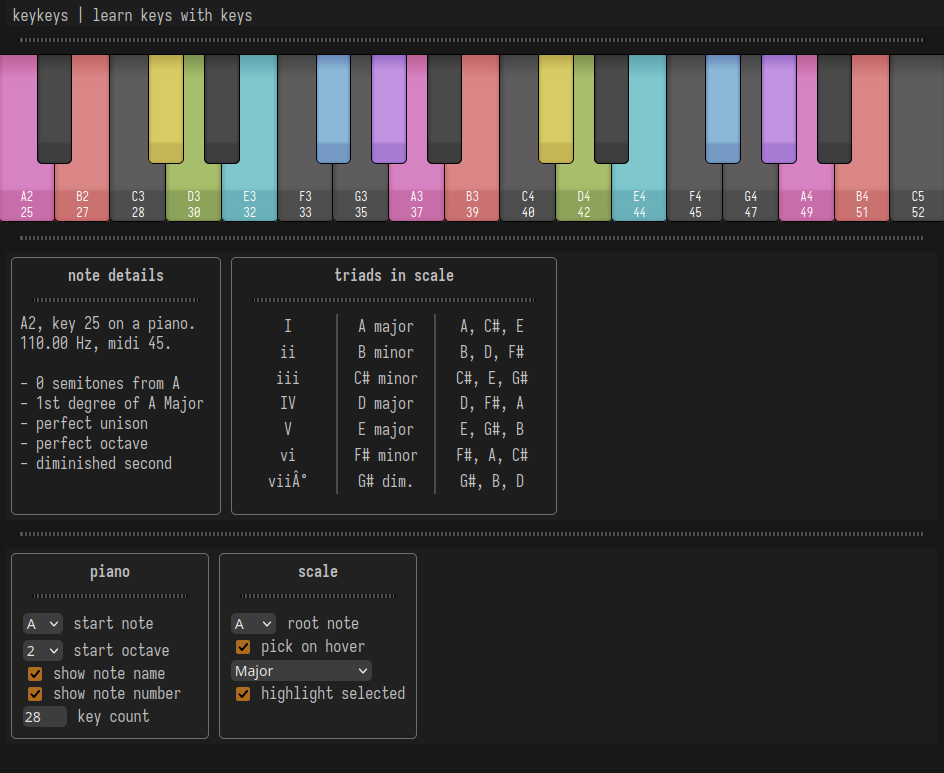

# keykeys

An older project of mine, this is a web-based interactive piano-based music theory study tool created with a few coding principles in mind: serverless, no dependencies, data-driven, using procedural C-esque JavaScript, respecting browser scope and rendering complexity. In the end I think it's a useful beginner's study guide for basic scales and chords on piano.

## running

You can locally host the files however you want. I use `python -m http.server` and visit `localhost:8000` in firefox. This loads `index.html` and runs client-side JavaScript to create the application.

# original design doc/todo

## todo

styling
- [x] make settings inputs prettier
- [x] make piano keys prettier
- [ ] make fretboard prettier
- [ ] animate key pressing - lower shadow, light up beneath?

piano creation
- [x] piano settings ui
- [x] basic piano creation settings functionality
- [ ] piano note text display toggle functionality
- [ ] trailing sharp keys fix

fretboard creation
- [ ] fretboard settings ui
- [ ] basic fretboard rendering

scale selection
- [x] scale settings ui
- [x] remove dependency on hardcoded tables
- [x] organize common scale signatures (data)
- [x] highlight scale patterns
- [x] differentiate intervals
- [x] select root note on hover
- [ ] display interval numbers below keys
- [ ] visual custom scale creation (detect known scales)

note analysis
- [x] display information about clicked note
    - [ ] list of chords this note is in
- [x] list 1-7 chords in selected scale
- [ ] account for flats in chord descriptions
- [ ] list seventh chords
- [ ] suggest chord progressions

audio synthesis
- [ ] play frequency on click
- [ ] allow for midi message input
- [ ] collect samples for piano
- [ ] implement sample-based instrument

demonstration
- [ ] demo-play scales, chords, and progressions

about/settings pane
- [ ] implement 'about' pane (visible on page load)
- [ ] cite sources used (wikipedia: CC-BY-SA)
- [ ] setting: consent to save session state in a cookie
- [ ] setting: interface zoom (50%, 80%, 100%, 125%, 150%, __)
- [ ] setting: input configuration (click, keyboard, MIDI)
- [ ] setting: audio outputs? is this possible?

misc. usability
- [ ] enable/disable 'premium' mode
- [ ] clickable animated duck

## [ ] unlocking premium

"Premium" mode includes a fretboard visualizer, custom scale creation, and theming options (two 'dark' and 'light' themes are free, but have a silly background, i.e. a repeating pattern of ducklings).

In the lower left corner of the page, there is a small dancing duck. When clicked, it quacks and flaps its wings. If the user clicks the duck 4 times, a dialogue window pops up:

"Wow! Nice rhythm. Surely, you must be a professional."
- I am.
    "In that case, you can afford to feed me, right?"
        - Of course! > proceed to payment dialogue
        - Maybe later. > end dialogue
- I might be.
    "Oh? Can you afford to feed a sad, lonely duck?"
        - Of course. > proceed to payment dialogue
        - Sorry, not yet.
            "Ah, too bad. I'm broke, too. Are you passionate about music?"
                - Yes, I am! > proceed to trial evaluation (no limit)
                - Not really. > end dialogue

Trial evaluation must be activated every time the user accesses the free version. In this mode, the duck unlocks the full premium feature set.

The duck itself is kind of minigame meant to provide a neutral companion in the student's studies, and it will dance as the student plays notes. Polishing this feature may include adding the ability to feed the duck, unlock various ponds, and hatch ducklings.

If lesson plans are implemented, progression along a track of guided tutorials may benefit from unlocking rewards for the duck companion minigame.

